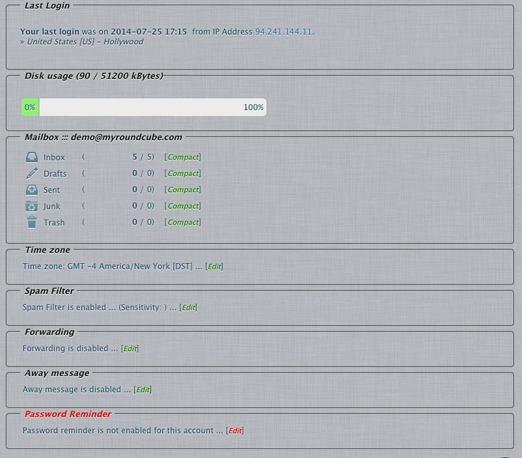

***********************************************
# Roundcube plugin Summary
***********************************************

Show a welcome page after login with mailboxes status summary, 
a GeoIP last login location and other settings related to the logged in user

* [x] Message of the day
* [x] Mailbox information
* [x] Time Zone
* [ ] GeoIP Last Login
* [ ] Spam Filter options (hmail_spamfilter plugin required)
* [ ] Forwarding options (hmail_forwarding plugin required)
* [ ] Away Message options (hmail_autoresponder plugin required)
* [ ] Password Reminder options (pwtools plugin required)
* [ ] Account lockout based on GeoIP location (pwtools plugin required)

## Requirements

Only tested this plugin with following environments. Other setup may work with luck.

- PHP: >= `5.1`
- Roundcube: `0.9`,`1.1`, `1.3`
  - Supported skins: `Classic`, `Larry`
- Those features not market are currently or optional or in development

## Installation

* Clone repository into roundcube `plugins/` directory as `summary` 
   * if have git do `git clone https://gitlab.com/roundcubevnz/roundcube-plugin-summary.git summary`
     or just download from gitlab, you must have a gitlab account and have history to able to do.
   * Database connection are optional only for GeoIP location and are currently in development, 
     table prefix must be tuned in the SQL scripts respect those setup at roundcube installation
* Copy `config.inc.php.dist` to `config.inc.php` and adjust it
   * Do not try to enable the GeoIP related ones neither hmail related ones, due 
     currently need some fix.
* Enable the plugin at `config/config.inc.php` by adding it to the `$config['plugins']` array.

## Debugging

* Most parts of MOTD are using frameset 
* Only contacts with an e-mail address are shown.

Links
=====

- Original : https://myroundcube.com/myroundcube-plugins/summary-plugin

## LICENSE

Where it's rosally ?

I never see a contract to me to hold any rights.. 
as i never see a contract from rosally to sure the plugins support!

So as section "c" said: 

 (c)	User agrees not to transfer MyRoundcube Plugins (code) for 
 gain or otherwise. Transfer of such code will result in termination 
 of contract with end user.

It's clear that "myroundcube" broke the rules and also we broke in retribution.
In any case, this plugin are relicensed ar CC-BY-SA
